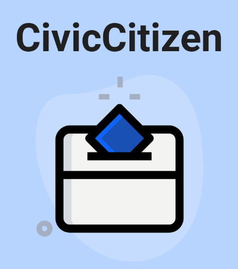
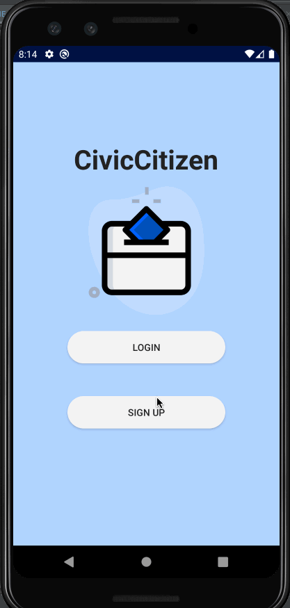
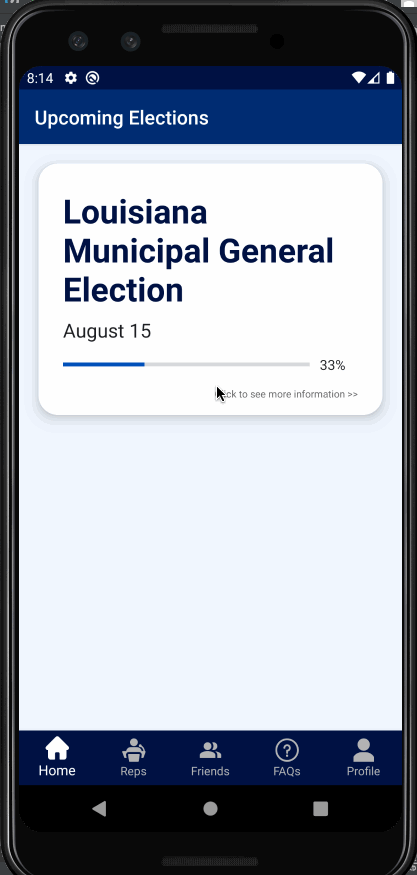
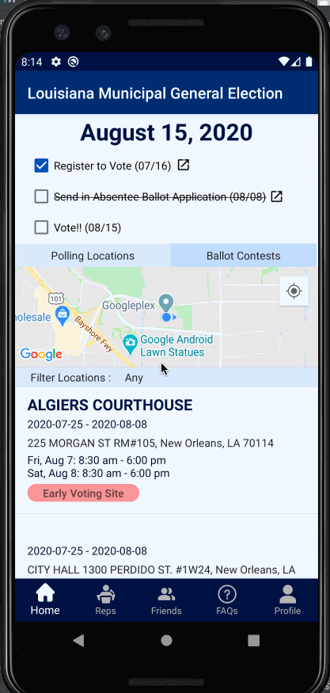
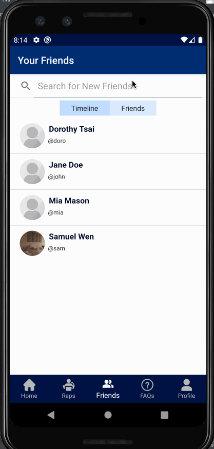
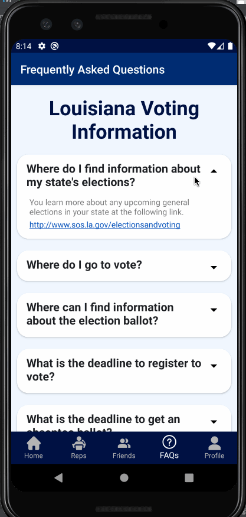
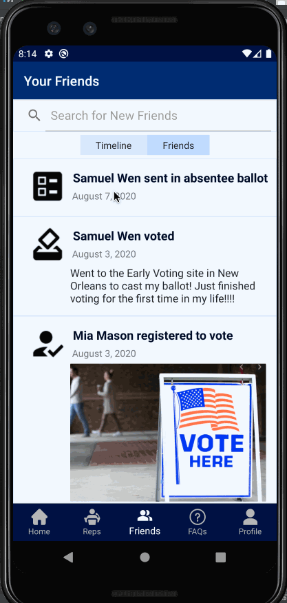

CivicCitizen - Original App FBU Engineering Project

===

## Table of Contents
1. [Overview](#Overview)
1. [Product Spec](#Product-Spec)
1. [Wireframes](#Wireframes)
2. [Schema](#Schema)

## Overview
### Description
A civic engagement app that aims to increase voter turnout and help provide users with the information they need to make their voice heard in politics. Users can view upcoming elections, contact their local representatives, remind friends of election deadlines and find voting locations nearby. 

### App Evaluation
- **Category:** Education/Information
- **Mobile:** The mobile app would allow you to share and interact with other users while a web version could simply provide you with information about the elections/representatives in your area. 
- **Story:** Overall, I hope by creating this app, I can encourage people to stay civically engaged in order to empower them to vote for a government that best represents everyone. Voting rates are extremely low because information is not easily accessible, resulting in decreased representation, especially for low-income and minority communities. 
- **Market:** The market is for anyone who struggles to stay informed about elections and voting days, especially in local government. It is also a good way for people who want their voice to do more and vote in ways that push legislation they want.
- **Habit:** A crucial aspect of this app would be to send notifications to the user about elections after they enter their address. That way, people do not need to check the app everyday for new information about upcoming elections. 
- **Scope:** The very basic MVP is an app just provides notifications about elections the user can participate in as well as information about how to vote. Hopefully though, I can add more information about candidates running, and also other ways to engage civically like messaging representatives and voting on propositions. 

### App Demo/Walkthrough

| Login and Sign Up | Profile (Edit + Actions) | Tab Overview |
| -------- | -------- | -------- |
|  |      | |

| Election Deadlines/Details | Polling Locations | Representatives |
| -------- | -------- | -------- |
|  |      | |

| Friends (add, search, requests) | FAQs | Friend Timelines |
| -------- | -------- | -------- |
|  |      | |

## Product Spec

### 1. User Stories (Required and Optional)

**Basic MVP Stories**

* Users can create a profile with their location (as well as edit this profile)
* Users can view a list of all elections they can participate in
* Users have access to information about how to vote, register to vote, absentee ballots, and voting by mail options
* Users can see a list of all of their local representatives (and contact information)
* Each election can be clicked on to show a detailed information screen which shows...
    * candidates running
    * a map of local polling locations
    * important deadlines and actions to take

**Additional Stories**

* Users can save "civic actions" that they have done like voting, registering to vote or sending in an absentee ballot
    * They can also upload images or save notes with these actions
* Polling locations are sorted with a weighted sort that takes into account the user's location preferences and the distance from user's address
* Users can see and add friends
    * can view a timeline of friends' actions
    * can search for friends and view friends' profiles* Polling locations can be filtered based on location type
* Users can click on a candidate to learn about their basic policies and party alignment
* Users can send messages to their representatives within the app
* Users can only check off actions if the preceding actions have been completed
* Users can "close" the absentee ballot action if they are voting from home
* Users can drag and sort their locations preferences
* Users can share information about elections with their friends via message or social media

### 2. Screen Archetypes

* Upcoming Elections
   * Show list of all elections the user can participate in (name and date)
   * User can see their progress on elections based on how many deadlines/actions their completed
   * when an election is clicked it opens the election details screen
* Election Details
   * Checklist for deadlines regarding the election (register by, send mailing ballot by etc)
        * when clicked, the deadline opens up a dialog fragment that congratulates the user and allows them to add a picture, type notes, or share with friends
   * Toggle between...
       * All ballot contests (as provided by the database)
       * List/Map of polling locations on a map fragment and in a recycler view list
            * on click you can zoom to that location
            * on double click, opens google maps
            * filter button to choose which types of locations to view
* Voting Information FAQs
   * List of FAQs in regards to how to vote with state specific website (all dropdown)
* Friends Page
    * Search bar to add new friends
    * toggle bar between..
        * timeline to see friends' actions
        * list of current friends
            * if there are requests, user can view/accept them here too
* Local Representatives
    * List of all representatives for the user with information about contact, districts and office location
* Representative Details Page
    * View rep's name, address, position, district as well as social media icons, email, phone (if available)
* Profile Page
    * View user's name + username + profile picture
    * See all past actions
    * For the current user, you can see address, edit profile and logout
    * For other users, you can friend/unfriend them
* Edit Profile Page
    * Users can edit their location
    * Users can change/take profile picture
    * Users can drag and sort their location preferences
* Log-in page + Opening Screen
    * Users can create a new profile
    * Users can log into their account

### 3. Navigation

**Tab Navigation** (Tab to Screen)

* Homepage (Election List)
* Representatives List
* Friends/Timeline
* Voting Information
* Profile Page

**Flow Navigation** (Screen to Screen)
* Opening Screen
    * both login and sign up direct the user to the Login Page, but changes what is shown
* Election List
   * On item click -> Election Details Screen
* Election Details Screen
    * Can click on candidate -> Candidate information
    * double click on polling location to open map
    * toggle tabs can alternate between polling locations and ballot contests
    * if there are no contests, you can click "View FAQs" to go to the FAQs
* Representative List
    * on representative click -> can open Representative Details
    * when "Email" is clicked, the user can compose an email with a dialog fragment
* Profile Page
    * on click "Edit Profile" -> user can modify profile details and location preferences
* Edit Profile Page
    * on upload profile picture -> launch camera
* Friends Fragment
    * can toggle between timeline of friend's actions and list of friends
    * from the friend page, you can see friend requests which switches to a new fragment
    * clicking any post, friend or request, you can see that user's profile page

## Wireframes

## Schema

### Models
#### User

   | Property      | Type     | Description |
   | ------------- | -------- | ------------|
   | objectId      | String   | unique id for the user (default field) |
   | username      | String   | unique username (required) |
   | password      | String   | password for user (required) |
   | profilePic    | File     | image that for the user's profile picture |
   | addressLine1  | String   | address line 1 for user|
   | addressCity   | String   | city user is located in |
   | addressState  | String   | state user is located in |
   | addressZip    | String   | zip code of where the user lives |
   | locationPreferences    | Array   | array of preferences ranked 1, 3, 5 for Early Voting Sites, Drop Off Locations, and Polling Locations (in that order) |
   | friends       | Array   | array of friend usernames |
   | createdAt     | DateTime | date when user account is created (default field) |
   | updatedAt     | DateTime | date when user account is last updated (default field) |

#### Action
   | Property      | Type     | Description |
   | ------------- | -------- | ------------|
   | objectId      | String   | unique id for the action (default field) |
   | name          | String   | name of the action (i.e. registered to vote, voted) |
   | status        | String   | status of that action (i.e. unfinished, done, closed) |
   | electionId    | String   | id of the election from the Google Civic Information API |
   | dateCompleted | String   | nicely formatted date when the user checked off this action |
   | image         | File     | optional picture for the user to upload when completing that action |
   | notes         | String   | any note the user wants to write about that action to remember |
   | createdAt     | DateTime | date when user account is created (default field) |
   | updatedAt     | DateTime | date when user account is last updated (default field) |
   
### Networking
#### List of network requests by screen
   - User Profile Page
      - (Read/GET) Query information about the user for profile
      - (Update/PUT) Update the user's profile (location, picture etc)
      - (Update/PUT) Update an action from the user's profile
   - Election List Screen
       - (Read/GET) Query all elections where the user is in the appropriate location
   - Election Details Screen
      - (Create/POST) Create a user civic action
      - (Delete) Delete an action
      - (Read/GET) Query all of the polling locations
   - Representatives Screen
      - (Read/GET) Query all of the user's representatives and save them to objects
   - FAQs Screen
      - (Read/GET) Query all of the user's state urls
   - Friends Screen
      - (Read/GET) Query all of the user's friends' actions
      - (Read/GET) Query all of the user's friends from Parse
      - (Read/GET) Query all other user's to find friend requests

#### Existing API Endpoints
##### Google Civic Information API
- Base URL - [https://www.googleapis.com/civicinfo/v2](https://www.googleapis.com/civicinfo/v2)

   HTTP Verb | Endpoint | Description
   ----------|----------|------------
   GET  |/elections | List of available elections to query.
  GET  |/voterinfo | Looks up information relevant to a voter based on the voter's registered address. Required query parameters: address
    GET  | /representatives |	Looks up political geography and representative information for a single address.
